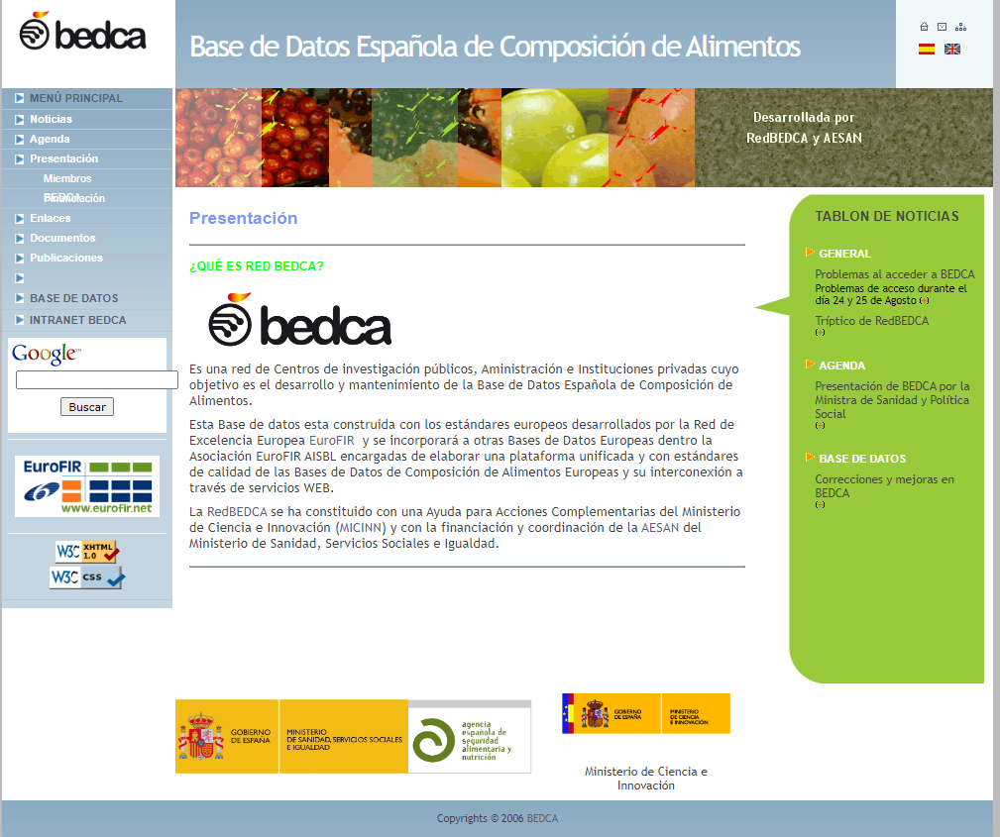

# BEDCA Web Scraper

This web scraper was developed to extract food content and calorie data from the BEDCA database. This database is old and its website is rudimentary and beyond obsolete. So to work with the data it contains I preferred to web scrape the data it contains in order to make something useful.

You can find the website of the database at the following [link](https://www.bedca.net/).

## What is the BEDCA database?

By the definition given by BEDCA itself, it is a network of public research centres, government and private institutions whose objective is the development and maintenance of the Spanish Food Composition Database.

This database is built with the European standards developed by the European Network of Excellence EuroFIR and will be incorporated to other European Databases within the EuroFIR AISBL Association in charge of elaborating a unified platform with quality standards of the European Food Composition Databases and their interconnection through WEB services.

The RedBEDCA has been set up with a grant for Complementary Actions from the Ministry of Science and Innovation (MICINN) and with the funding and coordination of the AESAN of the Ministry of Health, Social Services and Equality.